# Diffusion
[English](#) | [简体中文](./README_zh_cn.md)


a powerful [stable-diffusion-webui](https://github.com/AUTOMATIC1111/stable-diffusion-webui) client for android

## Feature
- text to image [wiki](https://github.com/AllenTom/diffusion-client/wiki/QuickStart)
- image to image [wiki](https://github.com/AllenTom/diffusion-client/wiki/Image-to-image)
- inpaint image [wiki](https://github.com/AllenTom/diffusion-client/wiki/Image-to-image#inpaint)
- control net [wiki](https://github.com/AllenTom/diffusion-client/wiki/Extension-%E2%80%90-ControlNet)
- lora [wiki](https://github.com/AllenTom/diffusion-client/wiki/Lora-management)
- history management
- model management [wiki](https://github.com/AllenTom/diffusion-client/wiki/Model-management)
- control net management [wiki](https://github.com/AllenTom/diffusion-client/wiki/Extension-%E2%80%90-ControlNet)
- tag from image
- extra image [wiki](https://github.com/AllenTom/diffusion-client/wiki/Extension-%E2%80%90-Hires-fix)
- sdxl support
- reactor (for face swap) [wiki](https://github.com/AllenTom/diffusion-client/wiki/Extension-%E2%80%90-Reactor)
- regional prompter [wiki](https://github.com/AllenTom/diffusion-client/wiki/Extension-%E2%80%90-Regional-prompter)
- link model to civitai model [wiki](https://github.com/AllenTom/diffusion-client/wiki/Model-management#automatically-matches-civitai-models)
- adetailer [wiki](https://github.com/AllenTom/diffusion-client/wiki/Extension-%E2%80%90-Adetailer)
## Preview
<p float="left">
  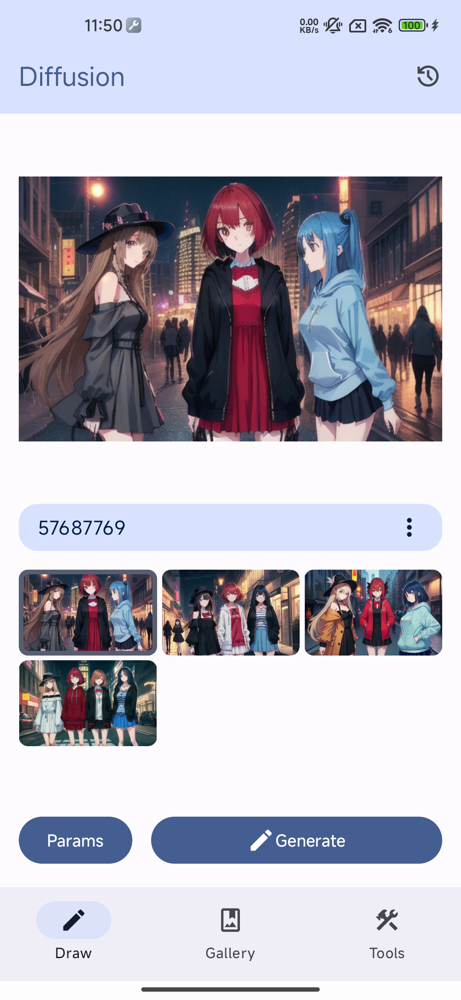
  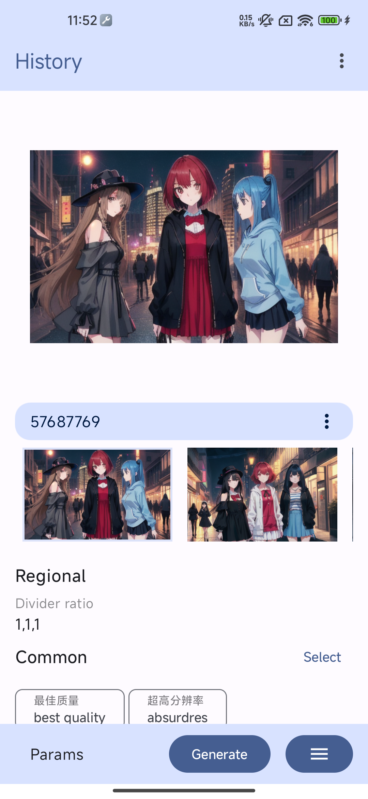 
  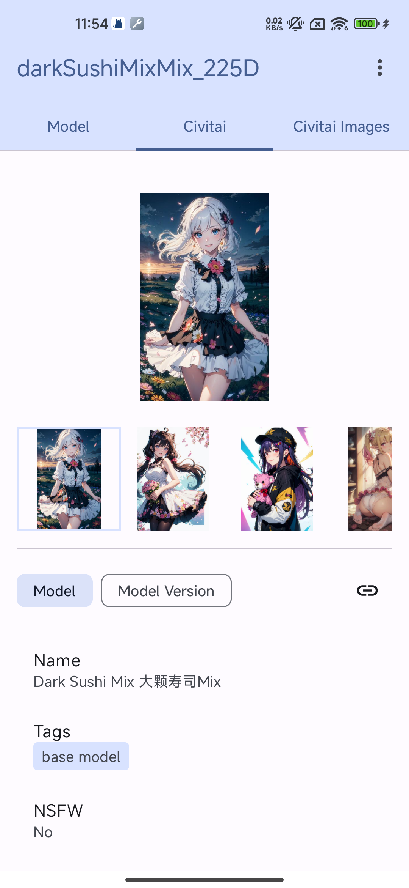 
  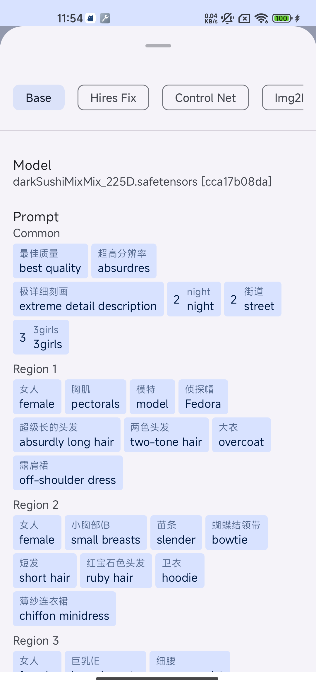 
  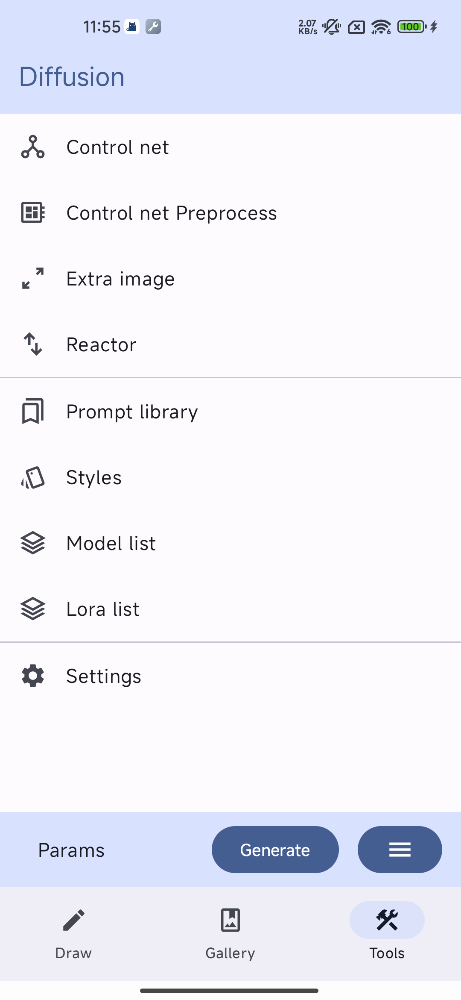 
</p>

## Device

If you are a foldable device user like the developer, some interfaces in the app have been optimized for the device.

<p float="left">
  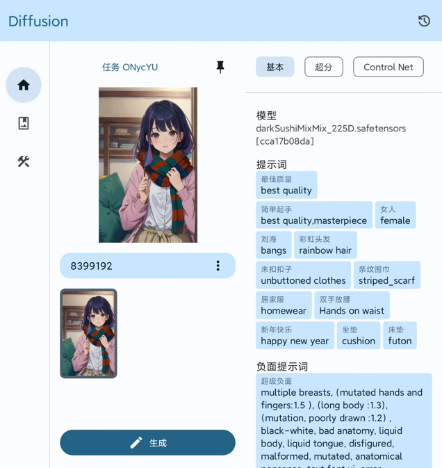
  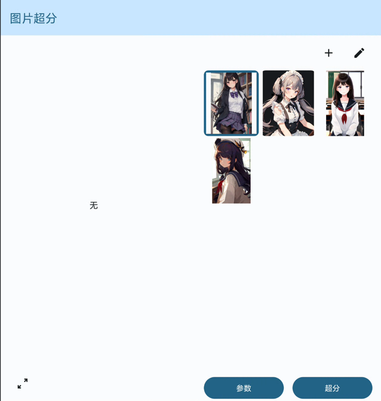 
  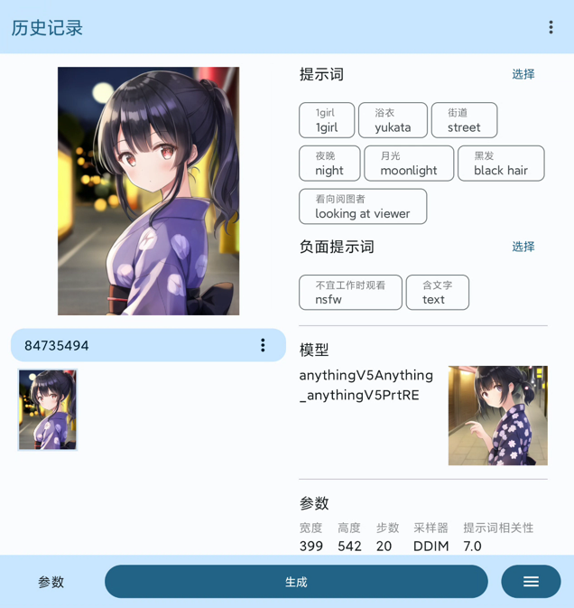 
  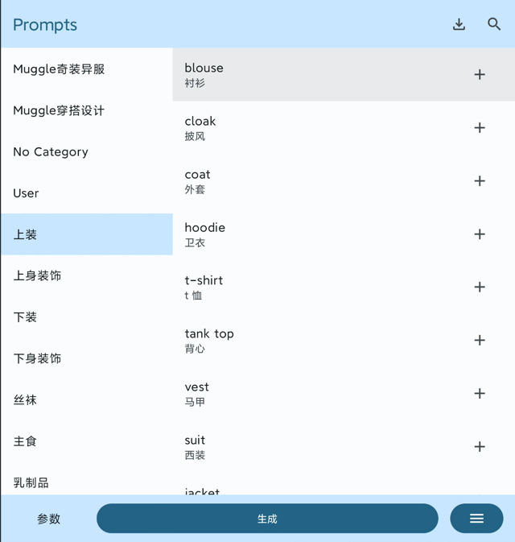 
</p>

Some interfaces in application is also optimized for tablet devices

<p float="left">
  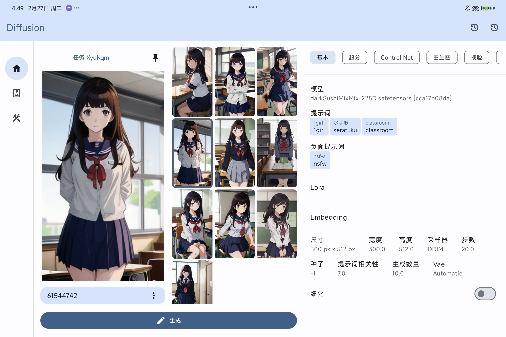
  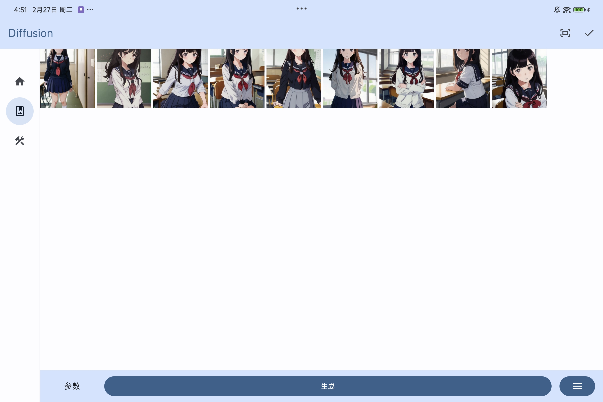 
  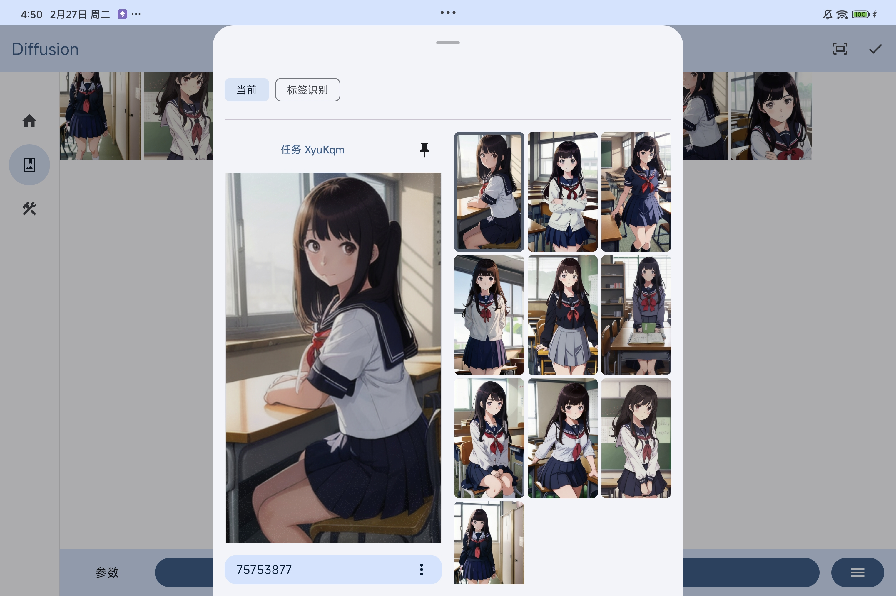 
</p>

## TODO
- complete app document
- adapt video generate plugin
- add more X/Y/Z Axis

## Requirement
Service base on [stable diffusion webui](https://github.com/AUTOMATIC1111/stable-diffusion-webui).

Please start the sdw service before using it. The guide are [here](https://github.com/AllenTom/diffusion-client/wiki/QuickStart#set-up-stable-diffusion-web-ui)

## Wiki
How to use the application is written in the [wiki](https://github.com/AllenTom/diffusion-client/wiki)

## Download
download from [release page](https://github.com/AllenTom/diffusion-client/releases)

## Enhance (Optional)
install stable diffusion web ui plugin for more auto match model with civitai model.

[diffusion-extension](https://github.com/AllenTom/diffusion-extension.git)

in stable-diffusion-webui extensions run command

```bash
git clone https://github.com/AllenTom/diffusion-extension.git
```

## Prompt Library
You can import prebuild prompt library from [here](https://github.com/AllenTom/diffusion-client/releases/tag/0.0.2)

In prompt library just import from file

