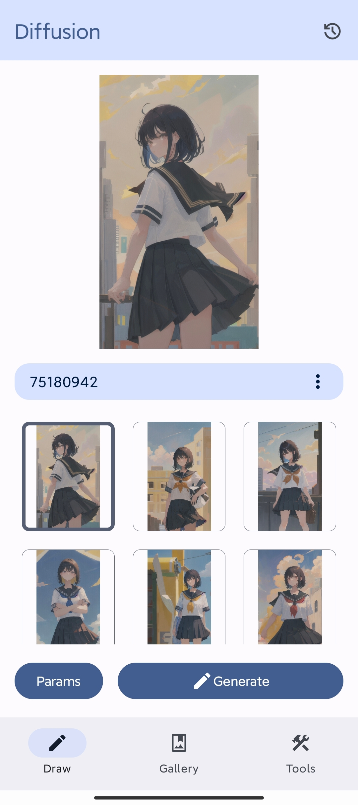
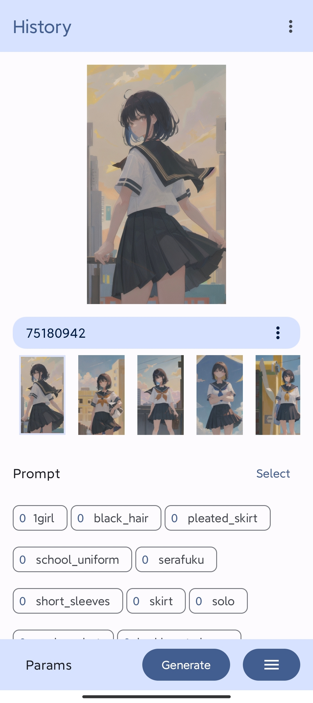
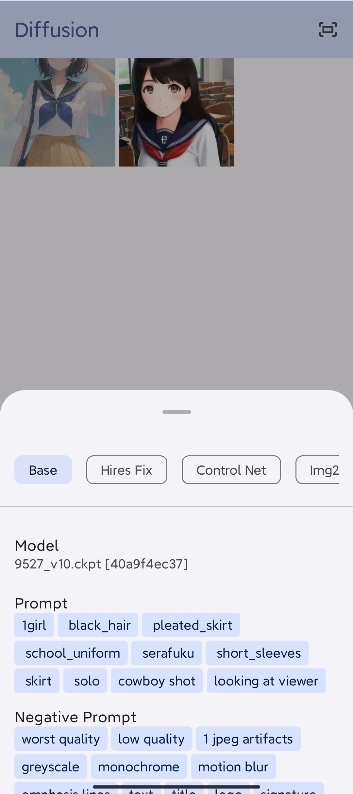
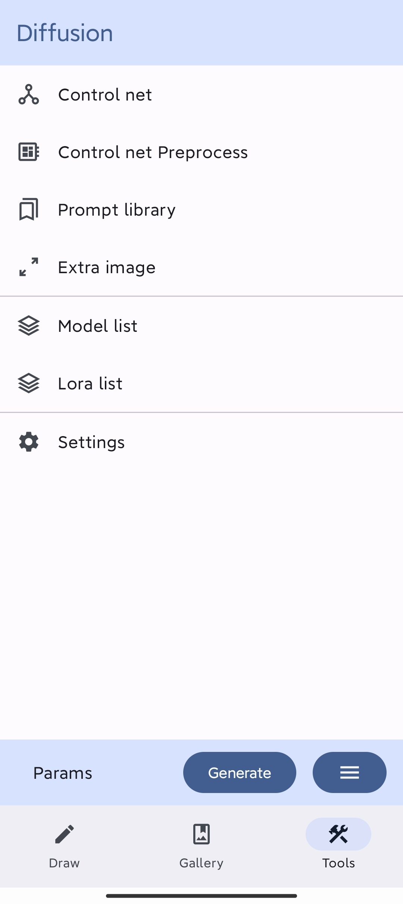

# Diffusion
[English](README.md) | [简体中文](#)

支持 Android 的功能丰富Stable-diffusion-webui 客户端

## 功能
- 文生图
- 图生图
- 局部重绘
- control net
- lora
- 生成历史记录管理
- 模型管理
- 图片反推
- 超分
- sdxl 支持
- reactor (换脸插件)
- 从 civitai 下载元信息
## 预览
<p float="left">
  
   
   
   
   
</p>

## 下载
可以从 [release page](https://github.com/AllenTom/diffusion-client/releases)下载

## 增强 (可选)
配合使用 stable-diffusion-webui 插件可以使用更多功能

[diffusion-extension](https://github.com/AllenTom/diffusion-extension.git)

在相应的插件目录中执行命令进行下载

```bash
git clone https://github.com/AllenTom/diffusion-extension.git
```