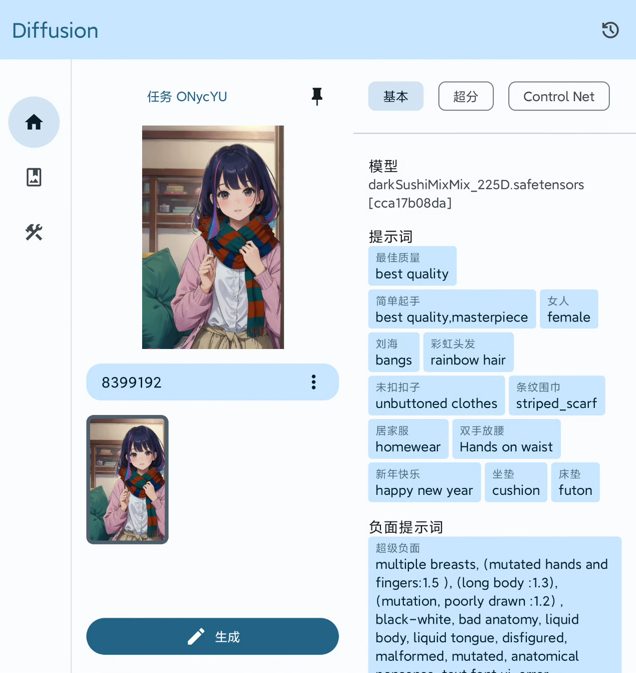
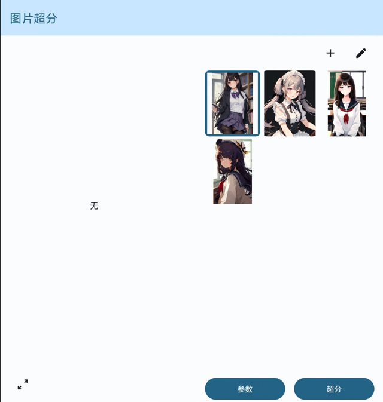
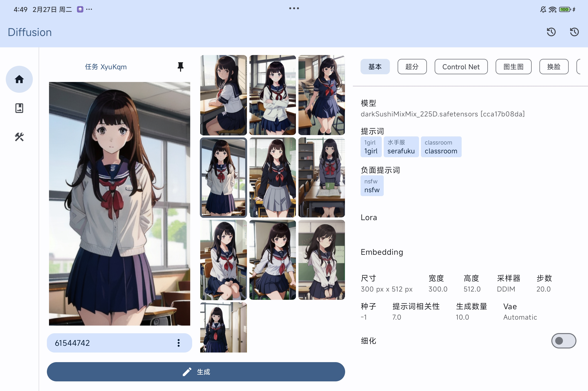
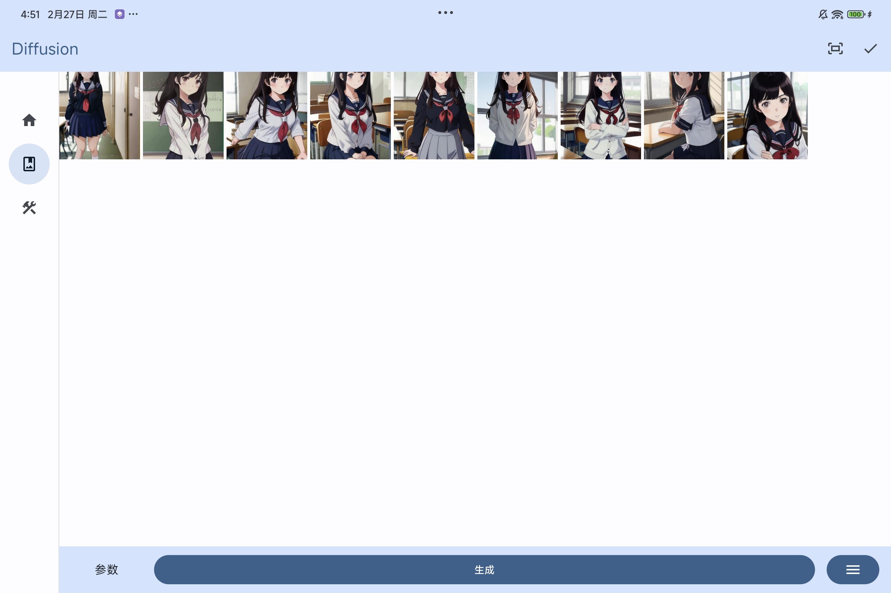
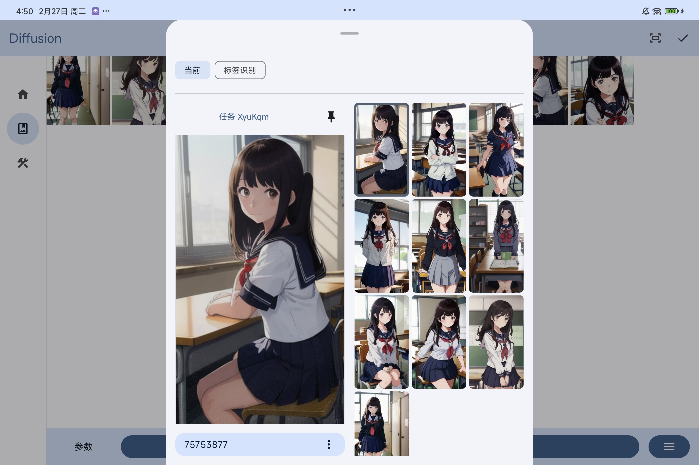

# Diffusion
[English](README.md) | [简体中文](#)

支持 Android 的功能丰富[Stable-diffusion-webui](https://github.com/AUTOMATIC1111/stable-diffusion-webui) 客户端

## 功能
- 文生图 [wiki](https://github.com/AllenTom/diffusion-client/wiki/QuickStart-%E2%80%90-zh_cn)
- 图生图 [wiki](https://github.com/AllenTom/diffusion-client/wiki/%E5%9B%BE%E7%94%9F%E5%9B%BE)
- 局部重绘 [wiki](https://github.com/AllenTom/diffusion-client/wiki/%E5%9B%BE%E7%94%9F%E5%9B%BE#%E9%87%8D%E7%BB%98inpaint)
- control net [wiki](https://github.com/AllenTom/diffusion-client/wiki/%E6%8F%92%E4%BB%B6-%E2%80%90-ControlNet)
- lora [wiki](https://github.com/AllenTom/diffusion-client/wiki/Lora-%E7%AE%A1%E7%90%86)
- 生成历史记录管理
- 模型管理 [wiki](https://github.com/AllenTom/diffusion-client/wiki/%E6%A8%A1%E5%9E%8B%E7%AE%A1%E7%90%86)
- 图片反推
- 超分 [wiki](https://github.com/AllenTom/diffusion-client/wiki/%E6%8F%92%E4%BB%B6-%E2%80%90-%E8%B6%85%E5%88%86)
- sdxl 支持
- reactor (换脸插件) [wiki](https://github.com/AllenTom/diffusion-client/wiki/%E6%8F%92%E4%BB%B6-%E2%80%90-Reactor)
- 区域提示词插件 [wiki](https://github.com/AllenTom/diffusion-client/wiki/%E6%8F%92%E4%BB%B6-%E2%80%90-%E6%8F%90%E7%A4%BA%E8%AF%8D%E5%88%86%E5%8C%BA)
- Adetailer 细节修复插件 [wiki](https://github.com/AllenTom/diffusion-client/wiki/%E6%8F%92%E4%BB%B6-%E2%80%90-Adetailer)
- 从 civitai 下载元信息 [wiki](https://github.com/AllenTom/diffusion-client/wiki/%E6%A8%A1%E5%9E%8B%E7%AE%A1%E7%90%86#%E8%87%AA%E5%8A%A8%E5%92%8C-civitai-%E6%A8%A1%E5%9E%8B%E5%8C%B9%E9%85%8D)
## 预览
<p float="left">
  
   
   
   
   
</p>

## 设备

如果你很幸运和开发者都是折叠设备使用者的话，应用内一些界面针对设备做了一些界面优化。

<p float="left">
  
   
   
   
</p>

应用中的一些界面也针对平板电脑设备做了界面上的适配

<p float="left">
  
   
   
</p>


## 需求
应用基于 [stable diffusion webui](https://github.com/AUTOMATIC1111/stable-diffusion-webui)，要使用应用，请先启动服务。[详见文档](https://github.com/AllenTom/diffusion-client/wiki/QuickStart-%E2%80%90-zh_cn#%E5%90%AF%E5%8A%A8-stable-diffusion-web-ui-%E6%9C%8D%E5%8A%A1)

## wiki
[wiki](https://github.com/AllenTom/diffusion-client/wiki/%E4%BD%BF%E7%94%A8%E6%89%8B%E5%86%8C) 记录了功能的使用方式，敬请查阅
## 下载
可以从 [release page](https://github.com/AllenTom/diffusion-client/releases)下载

## 增强 (可选)
配合使用 stable-diffusion-webui 插件可以使用更多功能

[diffusion-extension](https://github.com/AllenTom/diffusion-extension.git)

在相应的插件目录中执行命令进行下载
```bash
git clone https://github.com/AllenTom/diffusion-extension.git
```

## 提示词库
你可以在这里[这里](https://github.com/AllenTom/diffusion-client/releases/tag/0.0.2)下载提示词

在提示词管理的功能中导入提示词


